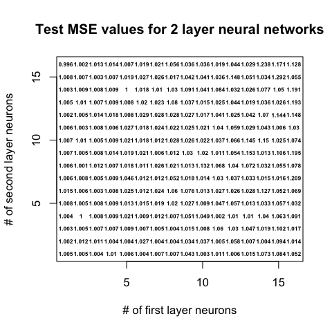
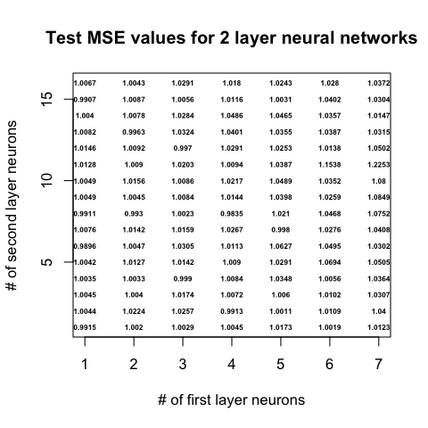
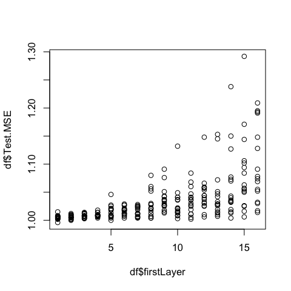
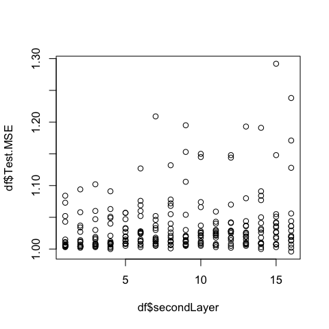
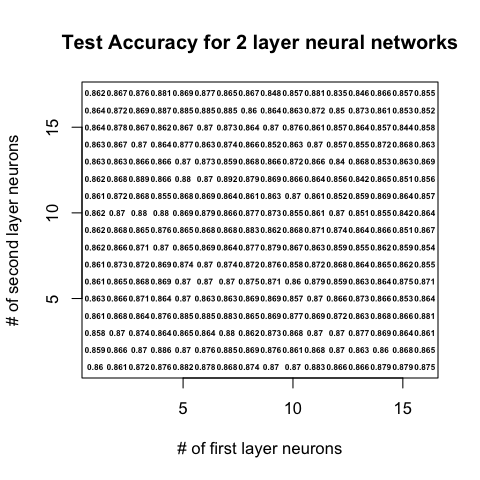
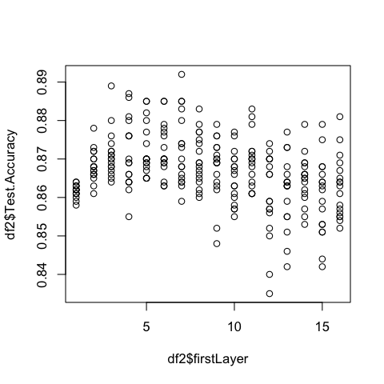
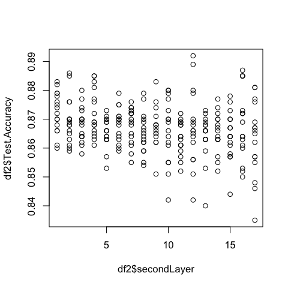

```{r setup, include=FALSE}
knitr::opts_chunk$set(echo = TRUE, tidy=TRUE, tidy.opts=list(width.cutoff=50))
```

***

## Midterm-2 Project Instruction

In `Midterm-1 Project`, you have built predictive models using train and test data sets about college students' academic performances and retention status. You fitted four regression models on \textbf{Term.GPA} and four classification models on \textbf{Persistence.NextYear}. the lowest test score of $MSE_{test}$ achieved on the regression problem was $.991$ using a simple linear regression, and the highest `accuracy` and `F1` scores obtained were $91.15$% and $95.65$%, respectively, with the fit of a multiple logistic regression model (equivalently, LDA and QDA give similar performances). Let's call these scores as baseline test scores.

In `Midterm-2 Project`, you will use tree-based methods (trees, random forests, boosting) and artificial neural networks (Modules 5, 6, and 7) to improve the baseline results. There is no any answer key for this midterm: your efforts and justifications will be graded, pick one favorite optimal tree-based method and one optimal ANN architecture for each regression and classification problem (a total of two models for classification and two models for regression), and fit and play with hyperparameters until you get satisfactory improvements in the test data set.

Keep in mind that $Persistence.NextYear$ is not included in as predictor the regression models so use all the predictors except that on the regression. For the classification models, use all the predictors including the term gpa.

First of all, combine the train and test data sets, create dummies for all categorical variables, which include `Entry_Term`, `Gender`, and `Race_Ethc_Visa`, so the data sets are ready to be separated again as train and test. (Expect help on this portion!) You will be then ready to fit models. 


***

\section{A. Improving Regression Models - 15 pts}

- Explore tree-based methods, choose the one that is your favorite and yielding optimal results, and then search for one optimal ANN architecture for the regression problem (so two models to report). Fit and make sophisticated decisions by justifying and writing precisely. Report `the test MSE` results in a comparative table along with the methods so the grader can capture all your efforts on building various models in one table.

\section{B. Improving Classification Models - 20 pts}

- Explore tree-based methods, choose the one that is your favorite and yielding optimal results, and then search for one optimal ANN architecture for the classification problem (so two models to report). Fit and make sophisticated decisions by justifying and writing precisely. Report `the test accuracy` and `the test F1` results in a comparative table along with the methods so the grader can capture all your efforts in one table.


\section{C. Importance Analyses - 15 pts}

- Part a. Perform an importance analysis on the best regression model: which three predictors are most important or effective to explain the response variable? Find the relationship and dependence of these predictors with the response variable. Include graphs and comments.

- Part b. Perform an importance analysis on the best classification model: which three predictors are most important or effective to explain the response variable? Find the relationship and dependence of these predictors with the response variable. Include graphs and comments.

- Part c. Write a conclusion paragraph. Evaluate overall what you have achieved. Did the baselines get improved? Why do you think the best model worked well or the models didn't work well? How did you handle issues? What could be done more to get `better` and `interpretable` results? Explain with technical terms.

***

\section{Project Evaluation}

The submitted project report will be evaluated according to the following criteria: 

\begin{enumerate}
\item All models in the instruction used correctly 
\item Completeness and novelty of the model fitting 
\item Techniques and theorems of the methods used accurately
\item Reflection of in-class lectures and discussions
\item Achieved reasonable/high performances; insights obtained (patterns of variables)
\item Clear and minimalist write-ups
\end{enumerate}

If the response is not full or not reflecting the correct answer as expected, you may still earn partial points. For each part or model, I formulated this `partial points` as this:

- 20% of pts: little progress with some minor solutions; 
- 40% of pts: major calculation mistake(s), but good work, ignored important pieces; 
- 60-80% of pts: correct method used, but minor mistake(s). 

Additionally, a student who will get the highest performances from both problems in the class (`minimum test MSE` from the regression model and `highest F1` from the classification model) will get a BONUS (up to +2 pts). Just follow up when you think you did good job!

***

\section{Tips}

- `Term.gpa` is an aggregated gpa up until the current semester, however, this does not include this current semester. In the modeling of `gpa`, include all predictors except `persistent`.
- The data shows the `N.Ws`, `N.DFs`, `N.As` as the number of courses withdrawn, D or Fs, A's respectively in the current semester.
- Some rows were made synthetic so may not make sense: in this case, feel free to keep or remove.
- It may be poor to find linear association between gpa and other predictors (don't include `persistent` in `gpa` modeling).
- Scatterplot may mislead since it doesn't show the density.
- You will use the test data set to asses the performance of the fitted models based on the train data set.
- Implementing 5-fold cross validation method while fitting with train data set is strongly suggested.
- You can use any packs (`caret`, `Superml`, `rpart`, `xgboost`, or [visit](https://cran.r-project.org/web/views/MachineLearning.html)  to search more) as long as you are sure what it does and clear to the grader.
- Include helpful and compact plots with titles.
- Keep at most 4 decimals to present numbers and the performance scores. 
- When issues come up, try to solve and write up how you solve or can't solve.
- Check this part for updates: the instructor puts here clarifications as asked.


***

\newpage


## Your Solutions

I'm going to start by saying that I produced test statistics for every tree-based method that we discussed, but I hid the code for the models that under-performed. I also performed a rudimentary grid search for the neural network parts to help find a better than average neural network architecture. You can run that code if you want to reproduce results, but it takes a long time. For everyone's convenience, I captured images and printed them. The code that I ran for them though is shown.

```{r, include = FALSE}
library(ISLR) 
library(MASS) 
library(class) 
library(kableExtra) 
library(caret)
library(tree) 
library(randomForest)
library(gbm)
library(car)
library(neuralnet)
library(knitr)
```

```{r}
train <- read.csv("StudentDataTrain.csv")
test <- read.csv("StudentDataTest.csv")

full.data = rbind(train, test)
summary(full.data)
```

```{r}
full.data$Gender <- ifelse(full.data$Gender == "Male", 1, 0) #male = 1, female = 0
full.data$Race_Ethc_Visa <- ifelse(full.data$Race_Ethc_Visa == "Afram", 1, 
                          ifelse(full.data$Race_Ethc_Visa == "Asian", 2,
                          ifelse(full.data$Race_Ethc_Visa == "Hispanic", 3,
                          ifelse(full.data$Race_Ethc_Visa == "Multi", 4, 0))))

full.data$Entry_Term <- ifelse(full.data$Entry_Term == 2131, 0, 1) #2131 = 0, 2141 = 1
```

```{r}
summary(full.data)
```

```{r}
#when perc.withd is 1, perc.pass is always NA
#turning perc.pass na values into a unique value
#full.data$Perc.Pass = ifelse(is.na(full.data$Perc.Pass), 0, full.data$Perc.Pass) #might try 0
full.data$Perc.Pass = ifelse(is.na(full.data$Perc.Pass), -1, full.data$Perc.Pass)
cat("% Complete Cases Before NA Adjustments: ",sum(complete.cases(full.data)/nrow(full.data)))
#full.data <- na.omit(full.data)
```
For the perc.pass variable, removing the NA's or doing median/knn imputation for them is unwise. This is because, whenever perc.withd was 1, perc.pass was NA. This is a trend that we don't want to lose or misrepresent in our pre-processing. I decided to make the value -1. This has a chance to slightly skew the regression models, but I think removing them or changing their values using median/knn imputation would be worse.

```{r}
#look more specifically at what data has na values.
#gender.na <- full.data[is.na(full.data$Gender),]
#gender.na
#gender.na$Gender <- median(full.data$Gender, na.rm=TRUE)
#gender.na

#HSGPA.na <- full.data[is.na(full.data$HSGPA),]
#HSGPA.na
#HSGPA.na$HSGPA <- median(full.data$HSGPA, na.rm=TRUE)
#HSGPA.na

#SAT_Total.na <- full.data[is.na(full.data$SAT_Total),]
#SAT_Total.na
#SAT_Total.na$SAT_Total <- median(full.data$SAT_Total, na.rm=TRUE)
#SAT_Total.na

#if we wanted to median imputate the rest of the values instead of omitting them
full.data[is.na(full.data$Gender),]$Gender <- median(full.data$Gender, na.rm=TRUE)
full.data[is.na(full.data$HSGPA),]$HSGPA <- median(full.data$HSGPA, na.rm=TRUE)
full.data[is.na(full.data$SAT_Total),]$SAT_Total <- median(full.data$SAT_Total, na.rm=TRUE)
```

```{r}
summary(full.data)
```

```{r}
slr <- lm(Term.GPA~.-Persistence.NextYear,data = full.data)
summary(slr)
slr <- lm(Term.GPA~.-Persistence.NextYear-N.CourseTaken-N.RegisteredCourse-Perc.PassedEnrolledCourse,data = full.data)
vif(slr)
#Race_Ethc_Visa, Gender, HSGPA, SAT_Total, Entry_Term, N.Ws, N.DFs, N.As, N.PassedCourse, Perc.Pass, Perc.Withd, N.GraduateCourse, FullTimeStudent
```
I'm showing this again because I think this is important. In midterm 1, we used the same data and there were some multicollinearity problems. I'm going to have two sets of data, the full data with all variables, and the reduced data with all the variables except the variables that were causing large multicollinearity values (or perfect multicollinearity). The three variables of concern are Perc.PassedEnrolledCourse, N.CourseTaken, and N.RegisteredCourse. We will see which models perform better.

```{r}
full.data <- full.data[, c(1,2,3,4,5,9,10,11,12,15,16,17,18,8,13,14,6,7)] #last rows now response vars
```

```{r}
names(full.data)
reduced.data <- full.data[, c(1,2,3,4,5,6,7,8,9,10,11,12,13,17,18)] #getting rid of problem vars
names(reduced.data)
```
```{r}
dim(reduced.data)
5900/7415
6000/7415
#roughly 4/5 of the data for train set
```

```{r}
# neural networks train better with scaled data so I will use this normalizing function to create additional datasets for the neural network portion.
normalize <- function(x) {
  return ((x - min(x)) / (max(x) - min(x)))
}
```

```{r}
reduced.scaled.data <- as.data.frame(lapply(reduced.data, normalize))
full.scaled.data <- as.data.frame(lapply(full.data, normalize))
summary(full.scaled.data)
```

```{r}
set.seed(99)
rows <- sample(nrow(full.data))
train = rows[1:5900]
train.data = full.data[train,]
test.data = full.data[-train,]
train.data.sc <- full.scaled.data[train,]
test.data.sc <- full.scaled.data[-train,]
r.train.data = reduced.data[train,]
r.test.data = reduced.data[-train,]
r.train.data.sc = reduced.scaled.data[train,]
r.test.data.sc = reduced.scaled.data[-train,]
```

```{r}
#Response variables 
z1=test.data$Term.GPA #numerical
z2=test.data$Persistence.NextYear #categorical: 0, 1

z1.sc=test.data.sc$Term.GPA #numerical
z2.sc=test.data.sc$Persistence.NextYear #categorical: 0, 1
```

\subsection{Section A.} 
```{r, include = FALSE}
tree.gpa=tree(Term.GPA~.-Persistence.NextYear,data = train.data)
summary(tree.gpa)

tree.gpaR=tree(Term.GPA~.-Persistence.NextYear,data = r.train.data)
summary(tree.gpaR)
```

```{r, include = FALSE}
plot(tree.gpa)
text(tree.gpa,pretty=0)
```

```{r, include = FALSE}
cv.gpa=cv.tree(tree.gpa)
plot(cv.gpa$size,cv.gpa$dev,type='b')

cv.gpaR=cv.tree(tree.gpaR)
plot(cv.gpaR$size,cv.gpaR$dev,type='b')
```

```{r, include = FALSE}
par(mfrow=c(1,2))
yhat=predict(tree.gpa,newdata=test.data)
plot(yhat,z1)
abline(0,1)
tree.mse <- mean((yhat-z1)^2)
cat("Full Model Regression Tree Test MSE",mean((yhat-z1)^2),"\n")

yhatR=predict(tree.gpaR,newdata=r.test.data)
plot(yhatR,z1)
abline(0,1)
tree.mseR <- mean((yhatR-z1)^2)
cat("Reduced Model Regression Tree Test MSE",mean((yhatR-z1)^2))
```

```{r, include = FALSE}
set.seed(99)
bag.gpa=randomForest(Term.GPA~.-Persistence.NextYear, data=train.data, mtry=16, importance=TRUE)
bag.gpa

bag.gpaR=randomForest(Term.GPA~.-Persistence.NextYear, data=r.train.data, mtry=13, importance=TRUE)
bag.gpaR
```

```{r, include = FALSE}
par(mfrow=c(1,2))
yhat.bag = predict(bag.gpa,newdata=test.data)
plot(yhat.bag, z1)
abline(0,1)
bag.mse <- mean((yhat.bag-z1)^2)
cat("Full Model Bagging Test MSE",mean((yhat.bag-z1)^2),"\n")

yhat.bagR = predict(bag.gpaR,newdata=r.test.data)
plot(yhat.bagR, z1)
abline(0,1)
bag.mseR <- mean((yhat.bagR-z1)^2)
cat("Reduced Model Bagging Test MSE",mean((yhat.bagR-z1)^2))
```


```{r, include = FALSE}
set.seed(99)
forest.gpa=randomForest(Term.GPA~.-Persistence.NextYear,data=train.data, importance=TRUE)
yhat.forest = predict(forest.gpa,newdata=test.data)
forest.mse <- mean((yhat.forest-z1)^2)
cat("Full Model Random Forests Test MSE:",mean((yhat.forest-z1)^2), "\n")

forest.gpaR=randomForest(Term.GPA~.-Persistence.NextYear,data=r.train.data, importance=TRUE)
yhat.forestR = predict(forest.gpaR,newdata=r.test.data)
forest.mseR <- mean((yhat.forestR-z1)^2)
cat("Reduced Model Random Forests Test MSE:",mean((yhat.forestR-z1)^2))
```

```{r}
set.seed(99)
boost.gpa=gbm(Term.GPA~.-Persistence.NextYear,data=train.data,
                 distribution="gaussian",
                 n.trees=1500,
                 interaction.depth=4,
                 shrinkage= 0.01,
                 cv.folds = 5,
                 verbose=F)


boost.gpaR=gbm(Term.GPA~.-Persistence.NextYear,data=r.train.data,
                 distribution="gaussian",
                 n.trees=1500,
                 interaction.depth=4,
                 shrinkage=0.01,
                 cv.folds = 5,
                 verbose=F)
```

```{r}
par(mfrow=c(1,2))
best.iter.gpa = gbm.perf(boost.gpa, method = "cv")
best.iter.gpaR = gbm.perf(boost.gpaR, method = "cv")
#we want the best iteration tree because it doesn't overfit the data, compared to the last tree constructed
```

```{r}
par(mfrow=c(1,2))
yhat.boost.best=predict(boost.gpa,newdata=test.data,n.trees=best.iter.gpa)
plot(yhat.boost.best, z1)
abline(0,1)
boost.mse <- mean((yhat.boost.best-z1)^2)
cat("Full Model Boosting Test MSE:",mean((yhat.boost.best-z1)^2), "\n")

yhat.boost.bestR=predict(boost.gpaR,newdata=r.test.data,n.trees=best.iter.gpaR)
plot(yhat.boost.bestR, z1)
abline(0,1)
boost.mseR <- mean((yhat.boost.bestR-z1)^2)
cat("Reduced Model Boosting Test MSE:",mean((yhat.boost.bestR-z1)^2))
```
These plots don't look good, but the results we got are better than the baseline SLR test MSE.

```{r, eval=FALSE}
#You can run this if you want. It took a couple hours, but I obtained a mapping of MSE values based on the number of neurons in the first and second hidden layers. I ran this twice using k=16,k2=16 and then k=7,k2=16. I only plotted the conditional plots for the k=16,k2=16 run.
set.seed(99)
k=16
k2=16
mse.nns <- c()
mse.nns2 <- c()
for(neurons in (1:k)) {
  for(neurons2 in (1:k2)) {
    
    nn.gpa = neuralnet(Term.GPA~Race_Ethc_Visa+Gender+HSGPA+SAT_Total+Entry_Term+N.Ws+N.DFs+N.As+N.PassedCourse+Perc.Pass+Perc.Withd+N.GraduateCourse+FullTimeStudent+N.RegisteredCourse+N.CourseTaken+Perc.PassedEnrolledCourse, data = train.data.sc, hidden = c(neurons,neurons2), threshold = 0.5, stepmax = 1e+05, linear.output = TRUE, err.fct = "sse", act.fct = "tanh", rep = 5)
    
    pr.nn <- compute(nn.gpa,test.data.sc[,c(1:16)])
    pr.nn <- pr.nn$net.result*(max(full.data$Term.GPA)-min(full.data$Term.GPA))+min(full.data$Term.GPA)   
    test.cv.r <- (test.data.sc$Term.GPA)*(max(full.data$Term.GPA)-min(full.data$Term.GPA))+min(full.data$Term.GPA)   
    mse.nns2 <- c(mse.nns2,(sum((test.cv.r - pr.nn)^2)/(nrow(test.data.sc)-2)))
  
    print(neurons)
    print(neurons2)
    print((sum((test.cv.r - pr.nn)^2)/(nrow(test.data.sc)-2)))
  }
}
```

```{r, eval = FALSE}
#processing what I generated from previous r chunk

#mses <- round(mse.nns, 3)
mses <- round(mse.nns2, 4)
outer <- c()
inner <- c()
for(i in (1:k)){
  first <- rep(i,k2)
  #first <- matrix(c(first), ncol = 1)
  outer <- c(outer, first)
}

for(i in (1:k)){
  first <- seq(1,k2,1)
  #first <- matrix(c(first), ncol = 1)
  inner <- c(inner, first)
}
df <- data.frame("firstLayer" = outer,
                 "secondLayer" = inner,
                 "Test.MSE" = mses)

#creates a picture of the following plot.
#png('TwoLayerNN_RegTest2.png', res=100)
plot(df$firstLayer, df$secondLayer, col = "white", xlab = "# of first layer neurons", ylab = "# of second layer neurons", main = "Test MSE values for 2 layer neural networks")
text(df$firstLayer, df$secondLayer, labels = df$Test.MSE, cex = 0.5, font = 2)
#dev.off()

#png('FirstLayerVSmse.png', res=100)
plot(df$firstLayer, df$Test.MSE)
#dev.off()

#png('SecondLayerVSmse.png', res=100)
plot(df$secondLayer, df$Test.MSE)
#dev.off()
```

```{r, dpi=250, echo=FALSE}


```
You can take a look at the plots from above and due with them what you will. I find the more interesting information is in the following conditional plots.

```{r, dpi=250, echo=FALSE}
par(mfrow = c(1,2))


```
From the first layer vs mse plot, we can clearly see that the variance of mse values became larger as we increased the number of first hidden layer neurons. If we created a neural network with 1-7 first hidden layer neurons and any number of second layer neurons (up to 16), we can be fairly confident that our test mse value won't be higher than 1.05. This statement becomes more shaky when applied to the neural network architectures with more than 7 first hidden layer neurons. For the second layer vs mse plot, we can kind of see the same distribution occur, but it's slightly weaker. It seemed that 1-7 second hidden layer neuron architectures were less variable than the other larger architectures. Using the information from these plots, I decided that 1 first hidden layer neuron was best and, because it seemed like it didn't matter as much on the size of the second hidden layer, I decided to go with $\sqrt{p}$ (p = # of predictors), as the number of second hidden layer neurons.

It seems like this type of optimal architecture search is going past the scope of this project, but I thought it was fairly interesting to look at the results and see if there was any trend. I think there is a lot of research that can be done when it comes to finding optimal neural network architecture for a given problem. Anyways, back to the project!

```{r}
set.seed(99)
neurons = 1 
# best number of first hidden layer neurons (produced most consistently low mse values)
neurons2 = 4 
# sqrt(predictors) seems reasonable considering the choice of second hidden layer neurons didn't seem to play a big role in mse values with 1 first hidden layer neuron
nn.gpa = neuralnet(Term.GPA~Race_Ethc_Visa+Gender+HSGPA+SAT_Total+Entry_Term+N.Ws+N.DFs+N.As+N.PassedCourse+Perc.Pass+Perc.Withd+N.GraduateCourse+FullTimeStudent+N.RegisteredCourse+N.CourseTaken+Perc.PassedEnrolledCourse, data = train.data.sc, hidden = c(neurons,neurons2), threshold = 0.1, stepmax = 1e+05, linear.output = TRUE, err.fct = "sse", act.fct = "tanh", rep = 5)

plot(nn.gpa)
```

```{r}
pr.nn <- compute(nn.gpa,test.data.sc[,c(1:16)])
pr.nn <- pr.nn$net.result*(max(full.data$Term.GPA)-min(full.data$Term.GPA))+min(full.data$Term.GPA)   
test.cv.r <- (test.data.sc$Term.GPA)*(max(full.data$Term.GPA)-min(full.data$Term.GPA))+min(full.data$Term.GPA)
nn.mse <- sum((test.cv.r - pr.nn)^2)/(nrow(test.data.sc)-2)
cat("Neural Network Test MSE: ", nn.mse)
```

```{r}
set.seed(99)
neurons = 1 #best number of first hidden layer neurons
neurons2 = 4 # sqrt(predictors) seems reasonable
nn.gpa2 = neuralnet(Term.GPA~Race_Ethc_Visa+Gender+HSGPA+SAT_Total+Entry_Term+N.Ws+N.DFs+N.As+N.PassedCourse+Perc.Pass+Perc.Withd+N.GraduateCourse+FullTimeStudent, data = r.train.data.sc, hidden = c(neurons,neurons2), threshold = 0.1, stepmax = 1e+05, linear.output = TRUE, err.fct = "sse", act.fct = "tanh", rep = 5)
```

```{r}
pr.nn2 <- compute(nn.gpa2,r.test.data.sc[,c(1:13)])
pr.nn2 <- pr.nn2$net.result*(max(full.data$Term.GPA)-min(full.data$Term.GPA))+min(full.data$Term.GPA)   
test.cv.r2 <- (r.test.data.sc$Term.GPA)*(max(full.data$Term.GPA)-min(full.data$Term.GPA))+min(full.data$Term.GPA)
nn.mse2 <- sum((test.cv.r2 - pr.nn2)^2)/(nrow(r.test.data.sc)-2)
cat("Neural Network Test MSE: ", nn.mse2)
```

```{r}
mean((mean(z1)-z1)^2) #using mean to predict. This should be absolute worst prediction
```

```{r}
a.table = matrix(c(tree.mse, tree.mseR, bag.mse, bag.mseR, forest.mse, forest.mseR, boost.mse, boost.mseR, nn.mse, nn.mse2), ncol = 1)
rownames(a.table) = c("Full Model","Reduced Model","Full Model","Reduced Model","Full Model","Reduced Model",paste("Full Model (",as.character(best.iter.gpa),") trees"), paste("Reduced Model (",as.character(best.iter.gpaR),") trees"), "Full Model (2 Hidden Layers | 1-4)", "Reduced Model (2 Hidden Layers | 1-4)")
colnames(a.table) = c("Test MSE")

kable(a.table, caption = "Test MSE for All Tree and Neural Network Models") %>%
  kable_styling(latex_options = "hold_position") %>%
  pack_rows("Tree Models", 1,2) %>%
  pack_rows("Bagging Models", 3,4) %>%
  pack_rows("Random Forests Models", 5,6) %>%
  pack_rows("Best Iteration Boosting Models", 7,8) %>%
  pack_rows("Neural Networks", 9,10)
```

Here are the results for all of the tree-based regression models and the neural net. Bagging and Random Forests seem to prove fairly poorly with this data for regression. However, a basic 1 node regression tree, our best iteration boosting models, and our full model neural network. The 1 node regression tree is very similar to the SLR model as it only used HSGPA. The fact that no other tree could be found that includes any other variables to make a better model was surprising and shows that the data space we are dealing with doesn't partition easily into predictable sub-spaces. Boosting was the best model here, but by only about ~0.01-0.02. The reduced boosting model did only slightly better than the full boosting model.
```{r}
a2.table = matrix(c(boost.mse, boost.mseR, nn.mse, nn.mse2, mean((mean(z1)-z1)^2), .991), ncol = 1)
rownames(a2.table) = c(paste("Full Model (",as.character(best.iter.gpa),") trees"), paste("Reduced Model (",as.character(best.iter.gpaR),") trees"), "Full Model (2 Hidden Layers | 1-4)", "Reduced Model (2 Hidden Layers | 1-4)", "Response Mean as Predictor", "SLR Baseline")
colnames(a2.table) = c("Test MSE")

kable(a2.table, caption = "Test MSE for Best Tree and Neural Network Models") %>%
  kable_styling(latex_options = "hold_position") %>%
  pack_rows("Boosting Models", 1,2) %>%
  pack_rows("Neural Networks", 3,4) %>%
  pack_rows("Other", 5,6)
```

As we can see from the table above, this is our main table for Part A. I chose the boosting model for a couple reasons. I will mentioned most of them in my overall analysis in Part C. I will say that one of the reasons I chose Boosting is it produced better test MSE values than the other models. We can see here that the boosting models and full predictor neural network model performed better than our SLR baseline from project 1. I also included the test MSE if we used the mean of Term.GPA to predict Term.GPA. The same problem arises from project 1 where our models are not making much separation, performance wise, from the bare minimum method of predicting Term.GPA. The reduced neural network model actually performed worse than using Term.GPA mean as predictor. This tells us again that our data is very awkward to deal with and even models that can deal with very non-linear data like neural networks still had trouble predicting Term.GPA.

***

\newpage
\subsection{Section B.} 

I decided to include the classification tree results in the final pdf because I think the results are more interesting and show the difference between our models made for Term.GPA (1 node regression tree) vs Persistence.NextYear. I say the second part because I find that decision trees have a very nice characteristic in that if the optimal pruned tree has many nodes, all of the subspaces $R_i$ that we get from that tree are more likely data spaces that are easier to predict in. I think of the example given in the book where they show a cube partition into 5 different subspaces and each subspace is given a function value. I think of this example, but in even higher dimensions. The more nodes we see in the optimal decision tree, the more data spaces we have in our entire higher-dimensional data space that are easier to predict in. When this is the case, the actual data that we have is much nicer to deal with.

```{r}
train.data$Persistence.NextYear = factor(ifelse(train.data$Persistence.NextYear == 1, "Yes", "No"))
test.data$Persistence.NextYear = factor(ifelse(test.data$Persistence.NextYear == 1, "Yes", "No"))

r.train.data$Persistence.NextYear = factor(ifelse(r.train.data$Persistence.NextYear == 1, "Yes", "No"))
r.test.data$Persistence.NextYear = factor(ifelse(r.test.data$Persistence.NextYear == 1, "Yes", "No"))
```

```{r}
set.seed(99)
tree.year = tree(Persistence.NextYear~., data = train.data)
tree.yearR = tree(Persistence.NextYear~., data = r.train.data)
```

```{r}
par(mfrow=c(1,2))
cv.year=cv.tree(tree.year, FUN = prune.misclass)
plot(cv.year$size,cv.year$dev,type='b', main = "Full Model")

cv.yearR=cv.tree(tree.yearR, FUN = prune.misclass)
plot(cv.yearR$size,cv.yearR$dev,type='b', main = "Reduced Model")
```

```{r}
par(mfrow = c(1, 2))

prune.year = prune.misclass(tree.year, best = 7)
plot(prune.year)
text(prune.year, pretty = 0, cex = 0.5) 
title("Full Model Tree (7 Node)")

prune.yearR = prune.misclass(tree.yearR, best = 7)
plot(prune.yearR) 
text(prune.yearR, pretty = 0, cex = 0.5) 
title("Reduced Model Tree (7 Node)")
```

```{r}
tree.pred = predict(prune.year,test.data,type="class") #should be pruned tree from cv
tree.cm = table(test.data$Persistence.NextYear,tree.pred)
tree.cm

recall = tree.cm[2, 2]/(tree.cm[2, 2] + tree.cm[2,1])
precision = tree.cm[2, 2]/(tree.cm[2, 2] + tree.cm[1,2])

tree.f1 = 2 * (recall * precision)/(recall + precision)
cat("Full Model Classification Tree Test F1: ",tree.f1,"\n")

tree.accuracy = (tree.cm[1,1] + tree.cm[2,2]) / (length(test.data$Persistence.NextYear))
cat("Full Model Classification Tree Test Accuracy: ",tree.accuracy,"\n")
```

```{r}
tree.predR = predict(prune.yearR,r.test.data,type="class") #should be pruned tree from cv
tree.cmR = table(r.test.data$Persistence.NextYear,tree.predR)
tree.cmR

recall = tree.cmR[2, 2]/(tree.cmR[2, 2] + tree.cmR[2,1])
precision = tree.cmR[2, 2]/(tree.cmR[2, 2] + tree.cmR[1,2])

tree.f1.R = 2 * (recall * precision)/(recall + precision)
cat("Reduced Model Classification Tree Test f1: ",tree.f1.R,"\n")

tree.accuracyR = (tree.cmR[1,1] + tree.cmR[2,2]) / (length(r.test.data$Persistence.NextYear))
cat("Reduced Model Classification Tree Test Accuracy: ",tree.accuracyR,"\n")
```


```{r, include=FALSE}
set.seed(99)
bag.year=randomForest(Persistence.NextYear~., data=train.data, mtry=17, importance=TRUE)
bag.year

bag.yearR=randomForest(Persistence.NextYear~., data=r.train.data, mtry=14, importance=TRUE)
bag.yearR
```

```{r, include=FALSE}
bag.pred = predict(bag.year, test.data, type = "class")
bag.cm = table(test.data$Persistence.NextYear, bag.pred)
bag.cm

recall = bag.cm[2, 2]/(bag.cm[2, 2] + bag.cm[2,1])
precision = bag.cm[2, 2]/(bag.cm[2, 2] + bag.cm[1,2])

bag.f1 = 2 * (recall * precision)/(recall + precision)
cat("Full Model Bagging Test f1: ",bag.f1,"\n")

bag.accuracy = (bag.cm[1,1] + bag.cm[2,2]) / (length(test.data$Persistence.NextYear))
cat("Full Model Bagging Test Accuracy: ",bag.accuracy,"\n")
```

```{r, include=FALSE}
bag.predR = predict(bag.yearR, r.test.data, type = "class")
bag.cmR = table(r.test.data$Persistence.NextYear, bag.predR)
bag.cmR

recall = bag.cmR[2, 2]/(bag.cmR[2, 2] + bag.cmR[2,1])
precision = bag.cmR[2, 2]/(bag.cmR[2, 2] + bag.cmR[1,2])

bag.f1.R = 2 * (recall * precision)/(recall + precision)
cat("Reduced Model Bagging Test f1: ",bag.f1.R,"\n")

bag.accuracyR = (bag.cmR[1,1] + bag.cmR[2,2]) / (length(r.test.data$Persistence.NextYear))
cat("Reduced Model Bagging Test Accuracy: ",bag.accuracyR,"\n")
```

```{r, include=FALSE}
set.seed(99)
forest.year=randomForest(Persistence.NextYear~.,data=train.data, importance=TRUE)

forest.yearR=randomForest(Persistence.NextYear~.,data=r.train.data, importance=TRUE)
```

```{r, include=FALSE}
forest.pred = predict(forest.year, test.data, type = "class")
forest.cm = table(test.data$Persistence.NextYear, forest.pred)
forest.cm

recall = forest.cm[2, 2]/(forest.cm[2, 2] + forest.cm[2,1])
precision = forest.cm[2, 2]/(forest.cm[2, 2] + forest.cm[1,2])

forest.f1 = 2 * (recall * precision)/(recall + precision)
cat("Full Model Random Forests Test f1: ",forest.f1,"\n")

forest.accuracy = (forest.cm[1,1] + forest.cm[2,2]) / (length(test.data$Persistence.NextYear))
cat("Full Model Random Forests Test Accuracy: ",forest.accuracy,"\n")
```

```{r, include=FALSE}
forest.predR = predict(forest.yearR, r.test.data, type = "class")
forest.cmR = table(r.test.data$Persistence.NextYear, forest.predR)
forest.cmR

recall = forest.cmR[2, 2]/(forest.cmR[2, 2] + forest.cmR[2,1])
precision = forest.cmR[2, 2]/(forest.cmR[2, 2] + forest.cmR[1,2])

forest.f1.R = 2 * (recall * precision)/(recall + precision)
cat("Reduced Model Random Forests Test f1: ",forest.f1.R,"\n")

forest.accuracyR = (forest.cmR[1,1] + forest.cmR[2,2]) / (length(r.test.data$Persistence.NextYear))
cat("Reduced Model Random Forests Test Accuracy: ",forest.accuracyR,"\n")
```


```{r}
train.data$Persistence.NextYear = ifelse(train.data$Persistence.NextYear == "Yes", 1, 0)
test.data$Persistence.NextYear = ifelse(test.data$Persistence.NextYear == "Yes", 1, 0)

r.train.data$Persistence.NextYear = ifelse(r.train.data$Persistence.NextYear == "Yes", 1, 0)
r.test.data$Persistence.NextYear = ifelse(r.test.data$Persistence.NextYear == "Yes", 1, 0)
```

```{r}
set.seed(99)
par(mfrow=c(1,2))
boost.year=gbm(Persistence.NextYear~.,data=train.data,
                 distribution="bernoulli",
                 n.trees=2500,
                 interaction.depth=4,
                 shrinkage=0.01,
                 cv.folds = 5,
                 verbose=F)

best.iter.year = gbm.perf(boost.year, method = "cv")


boost.yearR=gbm(Persistence.NextYear~.,data=r.train.data,
                 distribution="bernoulli",
                 n.trees=2500,
                 interaction.depth=4,
                 shrinkage=0.01,
                 cv.folds = 5,
                 verbose=F)

best.iter.yearR = gbm.perf(boost.yearR, method = "cv")
```

```{r}
boost.probs.i = predict.gbm(boost.year, newdata=test.data, n.trees = best.iter.year, type = "response")
boost.probs.i = as.matrix(boost.probs.i)
boost.pred.i <- ifelse(boost.probs.i > 0.5, 1, 0)

boost.cm.i = table(test.data$Persistence.NextYear,boost.pred.i)
boost.cm.i

recall = boost.cm.i[2, 2]/(boost.cm.i[2, 2] + boost.cm.i[2,1])
precision = boost.cm.i[2, 2]/(boost.cm.i[2, 2] + boost.cm.i[1,2])

boost.f1.i = 2 * (recall * precision)/(recall + precision)
cat("Full Model Best Boosting Test f1: ",boost.f1.i,"\n")

boost.accuracy.i = (boost.cm.i[1,1] + boost.cm.i[2,2]) / (length(test.data$Persistence.NextYear))
cat("Full Model Best Boosting Test Accuracy: ",boost.accuracy.i,"\n")
```

```{r}
boost.probs.iR = predict.gbm(boost.yearR, newdata=r.test.data, n.trees = best.iter.yearR, type = "response")
boost.probs.iR = as.matrix(boost.probs.iR)
boost.pred.iR <- ifelse(boost.probs.iR > 0.5, 1, 0)

boost.cm.iR = table(r.test.data$Persistence.NextYear,boost.pred.iR)
boost.cm.iR

recall = boost.cm.iR[2, 2]/(boost.cm.iR[2, 2] + boost.cm.iR[2,1])
precision = boost.cm.iR[2, 2]/(boost.cm.iR[2, 2] + boost.cm.iR[1,2])

boost.f1.iR = 2 * (recall * precision)/(recall + precision)
cat("Reduced Model Best Boosting Test f1: ",boost.f1.iR,"\n")

boost.accuracy.iR = (boost.cm.iR[1,1] + boost.cm.iR[2,2]) / (length(r.test.data$Persistence.NextYear))
cat("Reduced Model Best Boosting Test Accuracy: ",boost.accuracy.iR,"\n")
```

```{r, eval=FALSE}
#You can run this if you want. It will take a couple hours, I was unable to run this through one sitting because it always produced some error. Run at your own risk in the rmd file. When I was able to run this though, I personally recorded the more promising architectures. (3 first layer neurons, 4 second layer neurons)

k=17
k2=17
f1.nns <- c()
acc.nns <- c()
for(neurons in (6:k)) {
  for(neurons2 in (1:k2)) {
    
    nn.year = neuralnet(Persistence.NextYear~Race_Ethc_Visa+Gender+HSGPA+SAT_Total+Entry_Term+N.Ws+N.DFs+N.As+N.PassedCourse+Perc.Pass+Perc.Withd+N.GraduateCourse+FullTimeStudent+N.RegisteredCourse+N.CourseTaken+Perc.PassedEnrolledCourse+Term.GPA, data = train.data.sc, hidden = c(neurons, neurons2), threshold = 2.5, stepmax = 1e+05, err.fct = 'ce', linear.output = FALSE)
    
    ypred = compute(nn.year, test.data.sc[,c(1:17)])
    ypred = ypred$net.result
    pred_class <- ifelse(ypred > 0.5,1,0)

    nn.cm <- confusionMatrix(as.factor(test.data.sc$Persistence.NextYear), as.factor(pred_class))
    
    recall = nn.cm$table[2,2]/(nn.cm$table[2,2] + nn.cm$table[2,1])
    precision = nn.cm$table[2,2]/(nn.cm$table[2,2] + nn.cm$table[1,2])

    f1.nns = c(f1.nns,(2 * (recall * precision)/(recall + precision)))
    accuracy = (nn.cm$table[1,1] + nn.cm$table[2,2])/length(test.data.sc$Persistence.NextYear)
    acc.nns = c(acc.nns,accuracy)
  
    print(neurons)
    print(neurons2)
    print((2 * (recall * precision)/(recall + precision)))
    print(accuracy)
  }
}
```

```{r, eval = FALSE}
#I tried to do the same grid search method as the regression part but I ran into many errors, related to the confusion matrix or the incompletion of the current iteration neural network, that stopped the for loops from completing. I had to run with parameters that made the neuralnet creation faster, but this causes an increase in variance with the results we obtain. What is in the table will be very different with a change of seed or a change in the data distribution. This process can potentially help us find the most optimal structure, but further research and trial and error would need to be attempted.

accs <- round(acc.nns, 3)
outer <- c()
inner <- c()
#accs <-round(c(accs, acc.nns), 3)

for(i in (6:16)){
  first <- rep(i,k2)
  #first <- matrix(c(first), ncol = 1)
  outer <- c(outer, first)
}

for(i in (6:16)){
  first <- seq(1,k2,1)
  #first <- matrix(c(first), ncol = 1)
  inner <- c(inner, first)
}
df2 <- data.frame("firstLayer" = outer,
                 "secondLayer" = inner,
                 "Test.Accuracy" = accs)

#creates a picture of the following plot.
#png('TwoLayerNN_ClassTest.png', res=100)
plot(df2$firstLayer, df2$secondLayer, col = "white", xlab = "# of first layer neurons", ylab = "# of second layer neurons", main = "Test Accuracy for 2 layer neural networks")
text(df2$firstLayer, df2$secondLayer, labels = df2$Test.Accuracy, cex = 0.5, font = 2)
#dev.off()

#png('FirstLayerVSacc.png', res=100)
plot(df2$firstLayer, df2$Test.Accuracy)
#text(df2$firstLayer, df2$Test.Accuracy, labels = df2$secondLayer, cex = 0.5, font = 2, pos = 4)
#dev.off()

#png('SecondLayerVSacc.png', res=100)
plot(df2$secondLayer, df2$Test.Accuracy)
#text(df2$secondLayer, df2$Test.Accuracy, labels = df2$firstLayer, cex = 0.5, font = 2, pos = 4) 
#dev.off()
```

```{r, dpi=250, echo=FALSE, out.height='85%'}

```
```{r, dpi=250, echo=FALSE}
par(mfrow = c(1,2))


```
The plots show a different shape than the regression plots for the tested neural nets. The first layer vs test MSE kind of shows a mountain shape where the peak is around 4-5. The second layer vs test MSE again is less predictable. Overall, this method doesn't provide as much concrete information as the regression considering that the variances across all architectures seem to be more similar, and the hyperparameters I used were more geared towards speed of testing rather than quality and repeatability (lower variance). It does seem like architectures that are on the smaller side are slightly better than larger architectures, but there is a lot of room for me to big wrong about that. I decided to use the same process as I did when deciding the number of second layer neurons for the regression neural network and go with 4 first layer neurons and 4 second layer neurons.

```{r}
set.seed(99)
neurons = 4
neurons2 = 4
nn.year = neuralnet(Persistence.NextYear~Race_Ethc_Visa+Gender+HSGPA+SAT_Total+Entry_Term+N.Ws+N.DFs+N.As+N.PassedCourse+Perc.Pass+Perc.Withd+N.GraduateCourse+FullTimeStudent+N.RegisteredCourse+N.CourseTaken+Perc.PassedEnrolledCourse+Term.GPA, data=train.data.sc, hidden=c(neurons, neurons2), threshold = 1.5, stepmax = 1e+05, err.fct = 'ce', linear.output=FALSE, rep = 1) #increasing rep doesn't change result
plot(nn.year)
```

```{r}
ypred = compute(nn.year, test.data.sc[,c(1:17)])
ypred = ypred$net.result
pred_class <- ifelse(ypred > 0.5,1,0)

nn.cm <- confusionMatrix(as.factor(test.data.sc$Persistence.NextYear), as.factor(pred_class))
nn.cm$table

recall = nn.cm$table[2,2]/(nn.cm$table[2,2] + nn.cm$table[2,1])
precision = nn.cm$table[2,2]/(nn.cm$table[2,2] + nn.cm$table[1,2])

nn.f1 = 2 * (recall * precision)/(recall + precision)
cat("Neural Network Test f1: ",nn.f1,"\n")

nn.accuracy = (nn.cm$table[1,1] + nn.cm$table[2,2]) / (length(test.data.sc$Persistence.NextYear))
cat("Neural Network Test Accuracy: ",nn.accuracy,"\n")
```

```{r}
set.seed(99)
neurons = 4
neurons2 = 4
nn.year2 = neuralnet(Persistence.NextYear~Race_Ethc_Visa+Gender+HSGPA+SAT_Total+Entry_Term+N.Ws+N.DFs+N.As+N.PassedCourse+Perc.Pass+Perc.Withd+N.GraduateCourse+FullTimeStudent+Term.GPA, data=r.train.data.sc, hidden=c(neurons, neurons2), threshold = 1.5, stepmax = 1e+05, err.fct = 'ce', linear.output=FALSE, rep = 1) #increasing rep doesn't change result
```

```{r}
ypred2 = compute(nn.year2, r.test.data.sc[,c(1:14)])
ypred2 = ypred2$net.result
pred_class2 <- ifelse(ypred2 > 0.5,1,0)

nn.cm2 <- confusionMatrix(as.factor(r.test.data.sc$Persistence.NextYear), as.factor(pred_class2))
nn.cm2$table

recall = nn.cm2$table[2,2]/(nn.cm2$table[2,2] + nn.cm2$table[2,1])
precision = nn.cm2$table[2,2]/(nn.cm2$table[2,2] + nn.cm2$table[1,2])

nn.f1.2 = 2 * (recall * precision)/(recall + precision)
cat("Neural Network Test f1: ",nn.f1.2,"\n")

nn.accuracy2 = (nn.cm2$table[1,1] + nn.cm2$table[2,2]) / (length(r.test.data.sc$Persistence.NextYear))
cat("Neural Network Test Accuracy: ",nn.accuracy2,"\n")
```


```{r}
#predicting every observation as yes
stupid.df <- matrix(c(0,0,sum(test.data$Persistence.NextYear == 0),sum(test.data$Persistence.NextYear == 1)), nrow = 2)
stupid.df
stupid.recall <- stupid.df[2,2]/(stupid.df[2,2]+stupid.df[2,1])
stupid.precision <- stupid.df[2,2]/(stupid.df[2,2]+stupid.df[1,2])
stupid.f1 <- 2 * (stupid.recall * stupid.precision)/(stupid.recall + stupid.precision)
stupid.accuracy <- stupid.df[2,2]/length(test.data$Persistence.NextYear)
```

```{r}
b.table = matrix(c(tree.accuracy, tree.accuracyR, bag.accuracy, bag.accuracyR, forest.accuracy, forest.accuracyR, boost.accuracy.i, boost.accuracy.iR, nn.accuracy, nn.accuracy2, tree.f1, tree.f1.R, bag.f1, bag.f1.R, forest.f1, forest.f1.R, boost.f1.i, boost.f1.iR, nn.f1, nn.f1.2), ncol = 2)
rownames(b.table) = c("Full Model","Reduced Model","Full Model","Reduced Model","Full Model","Reduced Model",paste("Full Model (",as.character(best.iter.year),") trees"), paste("Reduced Model (",as.character(best.iter.yearR),") trees"), "Full Model (2 Hidden Layers | 4-4)", "Reduced Model (2 Hidden Layers | 4-4)")
colnames(b.table) = c("Test Accuracy", "Test F1")

kable(b.table, caption = "Test Accuracy and F1 Scores for All Tree and Neural Network Models") %>%
  kable_styling(latex_options = "hold_position") %>%
  pack_rows("Tree Models", 1,2) %>%
  pack_rows("Bagging Models", 3,4) %>%
  pack_rows("Random Forests Models", 5,6) %>%
  pack_rows("Best Iteration Boosting Models", 7,8) %>%
  pack_rows("Neural Networks", 9,10)
```

Our tree methods are all performing pretty closely to one another here. I think for best tree-based method, I'm still going to stick with the boosting model even though it had slightly worse performance scores compared to our basic pruned decision tree. I will explain my reasons for this in my overall paragraph. Our neural network did not perform as well compared to the tree-based methods. I had to make the threshold value much higher than I wanted to in order to get any results from the neural net so I think that has something to do with the lower performance scores.

```{r}
b2.table = matrix(c(boost.accuracy.i, boost.accuracy.iR, nn.accuracy, nn.accuracy2, stupid.accuracy, .9115,boost.f1.i, boost.f1.iR, nn.f1, nn.f1.2, stupid.f1,.9565), ncol = 2)
rownames(b2.table) = c(paste("Full Model (",as.character(best.iter.year),") trees"), paste("Reduced Model (",as.character(best.iter.yearR),") trees"), "Full Model (2 Hidden Layers | 4-4)", "Reduced Model (2 Hidden Layers | 4-4)", "Dominant Classification as Predictor (All Yes)", "Multiple Logistic Regression Baseline")
colnames(b2.table) = c("Test Accuracy", "Test F1")

kable(b2.table, caption = "Test Accuracy and F1 Scores for Best Tree and Neural Network Models") %>%
  kable_styling(latex_options = "hold_position") %>%
  pack_rows("Boosting Models", 1,2) %>%
  pack_rows("Neural Networks", 3,4) %>%
  pack_rows("Other", 5,6)
```

All of the methods we tested for the classification models actually produced worse performance scores than our logistic regression baseline. We did preprocess the data differently in project 1 than we did here so that might have played a role in lower performance scores. Or perhaps logistic regression is a great model for the given data. I was hoping that the neural network would've been able to similarly model the logistic regression, but be more refined and better predict some of the areas in the data space where the logistic regression was inaccurate in. However, given the hyperparameters and architecture that we chose, that was not the case. I think a look into a better combination of hyperparameters might result in slightly better performance checks out of the neural network.

***
\newpage
\subsection{Section C.} 

- Part a.

```{r}
X_reg = train.data[,c(1,2,3,4,5,6,7,8,9,10,11,12,13,14,15,16)]
predictor = Predictor$new(boost.gpa, data = X_reg, y = y1)
summary.gbm(boost.gpa)
plot(Partial$new(predictor, feature = "HSGPA"))
plot(Partial$new(predictor, feature = "SAT_Total"))
plot(Partial$new(predictor, feature = "Perc.Withd"))
```

```{r}
#importance analysis code for bagging and random forests models had we chosen them

#importance(bag.gpa)
#varImpPlot(bag.gpa)
#importance(forest.gpa)
#varImpPlot(forest.gpa)
```

```{r}
#partial dependence plots for variables with highest relative influence without iml library
plot(boost.gpa ,i="HSGPA")
plot(boost.gpa ,i="SAT_Total")
plot(boost.gpa ,i="Perc.Withd")
```

Above we have 3 partial dependence plots (with the iml library and with the plot fn), one for each HSGPA, SAT_Total, and Perc.Withd. These variables were the deemed to have the 3 highest relative influence from the summary.gbm function applied to our full boosting model (reduced will be studied next). These plots illustrate the effect that the individual variables have on the Term.GPA according to our model, when considering only the variable plotted. 

Thus, we can tell that HSGPA has a positive correlation with Term.GPA, however, as HSGPA increases (beyond the initial spike), the effect on Term.GPA becomes minimal. This makes sense that it was very effective in our classification tree model because a very low HSGPA indicates a low Term.GPA, but once HSGPA is greater than about 55, the Term.GPA stays relatively constant.

Looking at the plot for SAT_Total against Term.GPA here, it is surprising that this variable was one of high influence. The plot doesn't indicate that SAT_Total has a correlation with Term.GPA besides (maybe) a slight negative one, which contradicts what one may expect. We hypothesize that this variable gains its influence and predictability with the presence of a different variable in the model, likely HSGPA.

Lastly, the third strongest variable in terms of relative influence is Perc.Withd, but it is worth noting that the relative influence value is much smaller than the previous two and leads the rest of the pack by only a slight margin. When analyzing the partial dependence plot, the relationship is a little questionable, however there is some reasoning that can justify what we see, but it is worth noting this may be a stretch. It seems that a very low withdrawal percentage leads to a lower GPA (due to not withdrawing from difficult classes), then as withdrawal percentage increases so does the Term.GPA because the more difficult classes may have been withdrawn from. Continuing however, a large amount of withdrawals may indicate a weaker student, leading again to a low GPA, but an extremely high number of withdrawals means that very few classes are factored into Term.GPA, so it rises again. This reasoning was for the plot function, but with the iml library pdp, we see that Perc.Withd has no notable relationship with the response.

```{r}
predictorR = Predictor$new(boost.gpa, data = X_reg, y = y1)
summary.gbm(boost.gpaR)
plot(Partial$new(predictorR, feature = "HSGPA"))
plot(Partial$new(predictorR, feature = "SAT_Total"))
plot(Partial$new(predictorR, feature = "Perc.Withd"))
```

```{r}
#partial dependence plots for variables with highest relative influence
plot(boost.gpaR ,i="HSGPA")
plot(boost.gpaR ,i="SAT_Total")
plot(boost.gpaR ,i="Perc.Withd")
```
With the reduced model the relative influence numbers are slightly different, but the partial dependence plots look very similar so the analysis will be the same, which tells us that the excluded variables add little to nothing to the boosting model.

***
- Part b.

```{r}
X_class = train.data[,c(1,2,3,4,5,6,7,8,9,10,11,12,13,14,15,16,17)]
predictor.c = Predictor$new(boost.year, data = X_class, y = y2)
summary.gbm(boost.year)
plot(Partial$new(predictor.c, feature = "Term.GPA"))
plot(Partial$new(predictor.c, feature = "HSGPA"))
plot(Partial$new(predictor.c, feature = "SAT_Total"))
```

```{r}
#importance analysis code for bagginf and random forests models had we chosen them

#importance(bag.gpa)
#varImpPlot(bag.gpa)
#importance(forest.gpa)
#varImpPlot(forest.gpa)
```

```{r}
#partial dependence plots for variables with highest relative influence
plot(boost.year ,i="Term.GPA")
plot(boost.year ,i="HSGPA")
plot(boost.year ,i="SAT_Total")
```

```{r}
predictor.cR = Predictor$new(boost.yearR, data = X_class, y = y2)
summary.gbm(boost.yearR)
plot(Partial$new(predictor.c, feature = "Term.GPA"))
plot(Partial$new(predictor.c, feature = "HSGPA"))
plot(Partial$new(predictor.c, feature = "SAT_Total"))
```

```{r}
#partial dependence plots for variables with highest relative influence
plot(boost.yearR ,i="Term.GPA")
plot(boost.yearR ,i="HSGPA")
plot(boost.yearR ,i="SAT_Total")
```

Above we have partial dependence plots for the full and reduced model from the iml library and standard plot function. Here the predictors now include Term.GPA, which is considered our strongest predictor, and also HSGPA and SAT_Total once again are in the top three of predictors. The response, Persistence.NextYear is now categorical, so the shape of our curve is much more important than the values on the y-axis. Also the reduced model and full model give very similar results so the following explanations apply to both.

Term.GPA has a positive correlation with persistence, and it is clear that this relationship is very important because the relative influence score for Term.GPA as found by the summary.gbm function is by far the largest of any predictor. 

HSGPA has a similar relationship with persistence as it did with Term.GPA, one that is positive but also increases less drastically at higher values. Still it is clear though that as HSGPA increases, we can be more comfortable predicting a "yes" for persistence when integrating out all other variables.

Also, once again, SAT_Total has very little relationship with the response, and if there is any then it is a negative one, which is unexpected because typically one might believe higher SAT grades would correlate to a stronger student that is more likely to be persistent. But, it seems our data tells us that there is no relationship, or, in fact, it is very slightly negative.

***

- Part c.


***

\newpage

- BONUS.


***

\newpage

***
I hereby write and submit my solutions without violating the academic honesty and integrity. If not, I accept the consequences. 

### Write your pair you worked at the top of the page. If no pair, it is ok. List other fiends you worked with (name, last name): ... Avery Girsky

### Disclose the resources or persons if you get any help: ... Lab Codes, Previous Assignments

### How long did the assignment solutions take?: ...


***
## References
...
